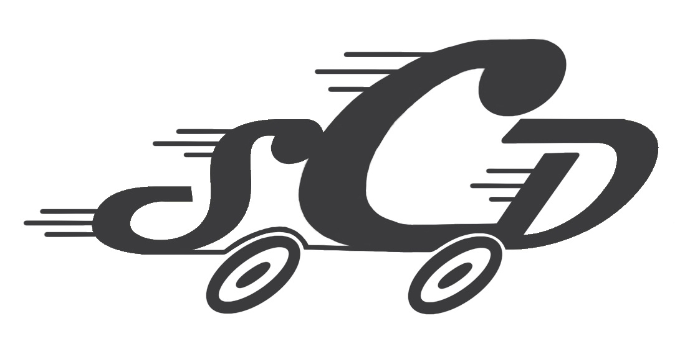

<h1>SICKEST CAR DASH - Dom, Josh, Mo, Xavier, Edward</h1>

SICKEST CAR DASH (SCD) is a vehicle dashboard project aimed at the daily driver, race car driver, and the sim racer. 

For actual vehicles, we'll be taking advantage of the OBDII system that is standard in all cars since 1996. Using a [CAN bus shield for the ESP32](https://store.mrdiy.ca/p/esp32-can-bus-shield/), we have a direct connection to the CAN bus of the vehicle. For the dash itself, we use a 12.3" ultrawide (1920x720) screen by Wisecoco that is connected to a Raspberry Pi. This Pi wirelessly connects to the ESP32's web server for data; with which the dash can be updated and telemetry can be recorded to an SD card.

Note: General Motors used a proprietary protocol called SAE J1850 VPW for many of their vehicles manufactured before 2008. Since our target vehicle (a 2004 Chevy Blazer) falls into this category, we are using J1850 VPW instead of the more modern CAN bus protocol. This choice affects how we communicate with the ECU and which commands/protocol settings we use with the ELM327 adapter.

## Feature List

- Displays for:
  - Speed
  - RPM
  - Fluid Temperatures
  - Warning Lights
  - Fuel Level
  - Throttle Position
  - Current Gear
  - Battery Voltage
- ~~Customizable Front End with profile support~~
  - Daily Driving
  - ~~Racing~~
- Stretch Goals
  - Telemetry
  - GPS Integration for Speed Warnings and Integrated Map
  - Driver Awareness - If user is detected falling asleep or distracted, tase them
  - Colorblind Accessibility

